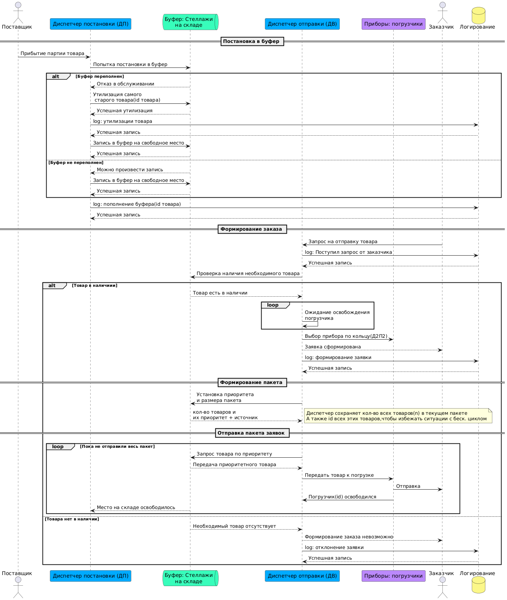

# Rack-Storage-Warehouse
Курсовая работа по дисциплине Архитектура программных систем

Дян Никита (группа 107).

[Яндекс диск с артефактами](https://disk.yandex.ru/d/IoJIseCJtGhNLw)

# 1. Диаграмма последовательностей

# 2. Диаграмма Классов

# 3. Блок-схема

